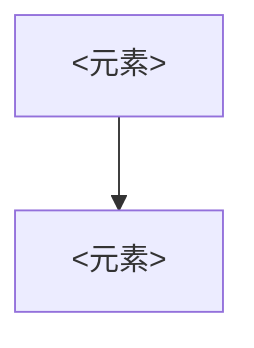

# <视图名>（42010 6.7 / 6.8）

> **管辖视角**：<vp-id，须来自 AD-02 已规约的视角>
> **框定的关注点**：<C1, C3>
> **依据版本**：`<短 sha>`（行号以此提交为准）

## 1. 视图构件（6.8）

### 1.1 <构件名>（model kind：<组件依赖图 / 端点清单 / 时序图 / …>）

**证据**：<逐个元素给出 `path/file.ext:行号`。这是本视图可信度的全部来源。>

### 1.2 <枚举性构件，用表格>（model kind：<清单>）

| <元素> | <职责> | <位置> |
|---|---|---|
| <…> | <…> | `<path:line>` |

## 2. 动机（必需）

<这个结构为什么是这样。**这是最容易漏、也最重要的一节**——缺动机的架构文档
让未来的修改者无法明智地改动。>

<逆向场景下动机多为推断或缺口，照实标注：>

【推断】<结构选择 X 的动机是 Y>（依据：<推理链>；置信度：<高/中/低>）

【缺口】<某选择的理由未知>（原因：<无 ADR，commit 只述 what>；可能获取途径：<上游 issue / 官方博客>）

<若官方文档给出的动机与代码行为矛盾，以代码为准，并把差异记入 AD-99 的漂移一节。>

## 3. 本视图的对应关系（6.9 局部）

指向其他视图的映射，汇总在 [AD-90](AD-90-correspondences.md)：

| 本视图元素 | 对应到 | 对应类型 | 证据 |
|---|---|---|---|
| <组件 A> | <开发视图的模块 M> | 实现 | `<path:line>` |

## 4. Known Issues（6.7 必需）

记录与视角约定的偏离、未覆盖区域、未决问题：

- **与视角约定的偏离**：<例：本视图元素数为 23，超出 5–20 约定；理由是…>
- **未覆盖**：<哪部分没画进来，为什么>
- **未决问题**：<看不明白的地方，需要动态验证或问维护者>

## 5. 本视图的证据局限

- <例：反射/依赖注入导致静态可达性分析可能漏掉入口，本视图的调用关系需动态验证>
- <例：条件编译使本视图仅反映默认 feature 组合下的结构>
